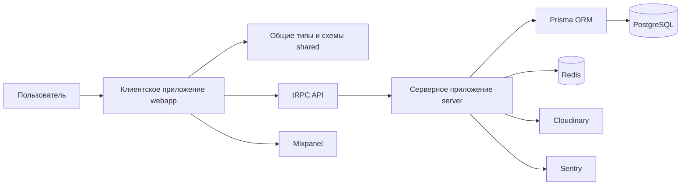

# Архитектура

## Общая схема

`Универ` реализован как клиент-серверное приложение с выделенной общей библиотекой типов. Клиент обращается к серверу через tRPC API, сервер работает с PostgreSQL через Prisma ORM.

Архитектура разделяет пользовательский интерфейс, серверную бизнес-логику и общий контракт данных. Обоснование ключевых технических выборов вынесено в [проектные решения](./decisions.md).

## Monorepo

Проект организован как monorepo с использованием `pnpm workspace`.

| Пакет | Назначение |
| --- | --- |
| `webapp` | Пользовательский интерфейс, навигация, формы, работа с API и клиентское состояние. |
| `server` | HTTP-сервер, tRPC-роутер, авторизация, бизнес-логика, доступ к БД. |
| `shared` | Общие типы, схемы входных данных и контракты между клиентом и сервером. |

Такое разделение уменьшает дублирование типов и снижает риск расхождения контракта между frontend и backend.

## Границы ответственности

| Слой | Ответственность |
| --- | --- |
| Клиент | Отображает интерфейс, управляет навигацией, формами и клиентским состоянием. |
| API | Принимает типизированные tRPC-вызовы и возвращает данные в формате общего контракта. |
| Сервер | Проверяет права, выполняет бизнес-логику, работает с БД и внешними сервисами. |
| Shared | Хранит общие типы и схемы, которые связывают клиент и сервер. |
| База данных | Хранит состояние пользователей, публикаций, сообществ, жалоб и уведомлений. |

Такое разделение позволяет развивать интерфейс и серверную логику независимо, но сохранять единый контракт между ними.

## Клиентское приложение

Клиентская часть построена на Expo и React Native. Для web-версии используется React Native Web. Навигация реализована через React Navigation.

Основные элементы клиентской архитектуры:

- `App.tsx` - корневой компонент приложения;
- `src/navigation` - навигационные стеки и deep links;
- `src/screens` - экраны приложения;
- `src/components/forms` - формы для создания и изменения данных;
- `src/lib/trpc.tsx` - настройка tRPC-клиента и React Query;
- `src/lib/tokenStorage.ts` - хранение и получение токена авторизации;
- `src/lib/mixpanel.tsx` - аналитика экранов;
- `src/lib/sentrySDK.tsx` - клиентская отправка ошибок.

Подробнее клиентская часть описана в [frontend.md](./frontend.md).

## Серверное приложение

Серверная часть построена на Express. API публикуется через tRPC middleware по пути `/trpc`.

Основные элементы серверной архитектуры:

- `src/index.ts` - запуск Express-приложения, CORS, Passport, tRPC и обработчик ошибок;
- `src/lib/trpc.ts` - инициализация tRPC, контекст запроса и логирование процедур;
- `src/lib/passport.ts` - авторизация через JWT;
- `src/lib/ctx.ts` - общий контекст приложения;
- `src/lib/prisma.ts` - подключение к Prisma;
- `src/router` - модульные tRPC-процедуры;
- `src/prisma/schema.prisma` - схема базы данных;
- `src/emails` - шаблоны писем MJML.

Подробнее серверная часть описана в [backend.md](./backend.md).

## Общий пакет

Пакет `shared` содержит схемы входных данных и общие типы. Он используется одновременно клиентом и сервером, что позволяет:

- переиспользовать Zod-схемы;
- получать типы входных и выходных данных tRPC;
- поддерживать общий контракт API без ручного описания DTO на клиенте.

## Авторизация и контекст запроса

Пользователь авторизуется с помощью JWT. Сервер извлекает пользователя из запроса через Passport и помещает его в tRPC-контекст как `me`.

Процедуры API используют этот контекст для проверки:

- выполнен ли вход;
- является ли пользователь владельцем сущности;
- имеет ли пользователь административные права;
- имеет ли пользователь права модератора или владельца сообщества.

Подробности реализации авторизации описаны в [backend.md](./backend.md), а список API-процедур - в [api.md](./api.md).

## Внешние сервисы

| Сервис | Назначение |
| --- | --- |
| PostgreSQL | Основное хранилище данных. |
| Redis | Опциональный кэш серверной части. |
| Cloudinary | Загрузка и хранение изображений. |
| Sentry | Сбор ошибок клиента и сервера. |
| Mixpanel | Клиентская аналитика экранов. |

## Развертывание

В репозитории предусмотрены Dockerfile для серверной и web-части. Корневой `package.json` содержит команды сборки и запуска Docker-образов.

Для локального запуска требуются:

- Node.js;
- pnpm;
- PostgreSQL;
- переменные окружения для сервера и клиента;
- миграции Prisma.
